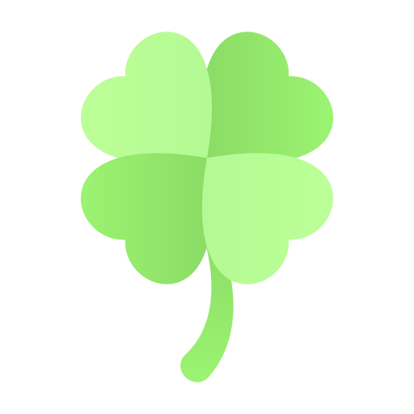

<h1 align="center">Search Facul</h1>
<h1 align="center">
    
</h1>
<h3 align="center">✅ Concluído ✅</h3>
<!-- <h3 align="center">🛠 Em Desenvolvimento 🛠</h3> -->

<p align="center">
 <a href="#-sobre-o-projeto">Sobre o projeto</a> •
 <a href="#-layout">Layout</a> • 
 <a href="#-como-executar-o-projeto">Como executar</a> • 
 <a href="#-tecnologias">Tecnologias</a> • 
 <a href="#-autor">Autor</a> • 
 <a href="#user-content--licença">Licença</a>
</p>

## 🎓 Sobre o projeto

O Aplicativo foi realizando durante o curso de Flutter no módulo basico ministrado pela [Danki Code](https://cursos.dankicode.com/?ref=I14162490C&hsrc=MjA1NjA1MDQyM2dhZHNwZXNxZGFua2ljdXJz). O projeto tem o intuito de mostrar frases do biscoito da sorte quando clicado no botão, e fazer uso de widgets mostrados no módulo, como **Container**, **Center**, **Padding**, **ElevateButton**, **CicleAvatar**, **Scaffold** e **Text**

---


## 📜 Tecnologias 

As seguintes ferramentas foram utilizadas na construção do projeto:

  [](https://pub.dev/)
  [](https://dart.dev/)

  


## 📚 Bibliotecas

As seguintes bibliotecas foram usadas na construção do projeto:
- **[Math](https://api.dart.dev/stable/2.19.4/dart-math/dart-math-library.html)**
- **[Google Fonts](https://pub.dev/packages/google_fonts)**

> Veja o arquivo  **[pubspec.ymal](https://github.com/Pedro-Balestra/Danki-Code/blob/main/Curso%20Flutter/app_biscoito_da_sorte/pubspec.yaml)**

### Utilitários

<!-- - Editor:  **[Visual Studio Code](https://code.visualstudio.com/)** -->

[](https://code.visualstudio.com/)

---

## 🎨 Layout

<p align="center" style="display: flex; flex-direction: column; align-items: flex-start; justify-content: center;">
    <p align="center" style="display: flex; align-items: flex-start; justify-content: center;">
    
    
</p>

---

## 🚀 Como executar o projeto

Basta seguir o s seguintes passos:

### Pré-requisitos

Antes de começar, você vai precisar ter instalado em sua máquina as seguintes ferramentas:
[Git](https://git-scm.com), [Flutter](https://docs.flutter.dev/get-started/install). 
Além disto é bom ter um editor para trabalhar com o código como [VSCode](https://code.visualstudio.com/)

```bash

# Clone este repositório
$ git clone https://github.com/Pedro-Balestra/Danki-Code/tree/main/Curso%20Flutter/app_biscoito_da_sorte.git

# Acesse a pasta do projeto

# Instale as dependências
$flutter pub add google_fonts

# Abra o emulador 

# Inicilize o Projeto
flutter run

```


---

## 👥 Autor
<h4 align="left">
    
</h4>

**Pedro Balestra**


[](https://www.linkedin.com/in/pedro-balestra/)
[](mailto:pedro.balestra@outlook.com)

---
## 📝 Licença
[](http://badges.mit-license.org)

- **[MIT license](https://choosealicense.com/licenses/mit/)**
